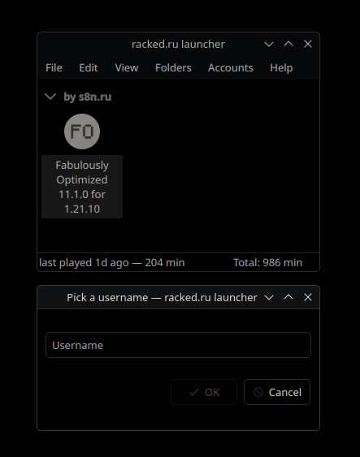

<div align="center">

# minecraft-launcher

<br>
<a href="https://github.com/s8n-ru/minecraft-launcher/releases/latest">
  
</a>
<br><br>

[](https://github.com/s8n-ru/minecraft-launcher/releases/latest)
[](https://github.com/s8n-ru/minecraft-launcher/releases/latest)
[](https://github.com/s8n-ru/minecraft-launcher/releases/latest)

---

an opinionated launcher  -  ***my based opinion***

built for myself, If your its to your taste, help yourself.

---



---

[Changelog](CHANGELOG.md) · [Audits](docs/)

</div>

---

## Trust

Don't take my word on the privacy stuff. Read the audits:

- [docs/NETWORK_AUDIT.md](docs/NETWORK_AUDIT.md) — every endpoint
  listed, telemetry verdict per call
- [docs/SETTINGS_AUDIT.md](docs/SETTINGS_AUDIT.md) — default-value
  diffs vs upstream
- [docs/BLOAT_AUDIT.md](docs/BLOAT_AUDIT.md) — what got stripped, why

It's GPL-3.0. Source is right there.

---

## Status

Personal project. I use it daily, that's the only QA. No support
guarantees. Bugs happen. Use at your own risk.

PRs welcome but not promised to merge — this is opinionated by
design.

```

CI builds via [GitHub Actions](.github/workflows/build.yml) for all 3
platforms on every tag.

---

## License

GPL-3.0-only. Per-file copyright headers preserved.

Based on [PrismLauncher](https://github.com/PrismLauncher/PrismLauncher)
(GPL-3.0), itself a fork of [PolyMC](https://github.com/PolyMC/PolyMC)
and [MultiMC](https://github.com/MultiMC/Launcher).

## Build from source

```bash
git clone https://github.com/s8n-ru/minecraft-launcher.git
cd minecraft-launcher

# Fedora 43
sudo dnf install cmake gcc-c++ ninja-build extra-cmake-modules \
    qt6-qtbase-devel qt6-qttools-devel qt6-qtsvg-devel qt6-qtnetworkauth-devel \
    libarchive-devel cmark-devel qrencode-devel tomlplusplus

# Ubuntu / Debian
sudo apt install cmake g++ ninja-build extra-cmake-modules \
    qt6-base-dev qt6-tools-dev qt6-svg-dev libqt6networkauth6-dev \
    libarchive-dev libcmark-dev libqrencode-dev libtomlplusplus-dev gamemode-dev libvulkan-dev

JAVA_HOME=/path/to/jdk-21 cmake -B build -G Ninja -DCMAKE_BUILD_TYPE=Release
cmake --build build -j$(nproc)
./build/prismlauncher

---
